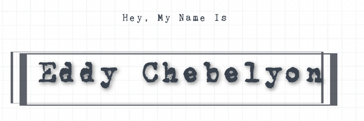

- 🔭 I’m currently working on geospatial data science @ [fraym.io](https://fraym.io/)
- 🌱 I’m currently learning Nuxt.js, d3.js and digging deeper into the AWS ecosystem
- 👯 I’m looking to collaborate on anything Machine Learning, geospatial development, GIS for the web
- 💬 Ask me about the English Premier League, specifically Chelsea Footbal Club
- 📫 How to reach me: [Email](kipedie@gmail.com)
- 😄 Pronouns: He/Him/His
- ⚡ Fun fact: I absolutely enjoy learning, wether it's about how to distinguish between a crow and a raven from their calls to figuring out ways to leverage advances in computing at my day job. When not developing, I enjoy the outdoors, early morning runs, and hikes with my girls.

### Languages

### Tools I use

